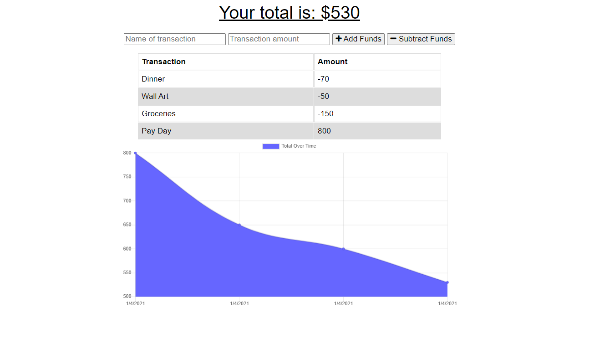

# Budget Tracker

            
## Description

This application allows users to add deposits & expenses to their budget both online as well as offline.

## User Story 

AS AN avid traveller
I WANT to be able to track my withdrawals and deposits with or without a data/internet connection
SO THAT my account balance is accurate when I am traveling.

## Table of Contents

[Installation](#installation)    
[Deployment](#deployment)                   
[License](#licenses)  
[Contributing](#contributing)                                                                                                          
[Questions](#questions) 

## Installation

1. Create a MongoDB Atlas account
2. Clone this repo.
3. Change mongoose connection details in server.js to your connection details.
4. Run 'npm i' to install all dependencies.
5. Run 'npm start' and navigate to https://localhost:5000 to view the application.

## Deployment

<a href="https://ps-budget-tracker.herokuapp.com/">Budget Tracker (click to view)</a>

## Licenses

The underlying source code used to format and display this content is licensed under the 

## Contributing

Setup - <a href="https://www.trilogyed.com/">Trilogy Education Services</a>                        
Offline Functionality - Prabh Singh  

## Questions 

My Github profile is <a href="https://github.com/prabhm512">prabhm512</a>.

If you have any questions regarding this project, please email prabhm512@gmail.com.
